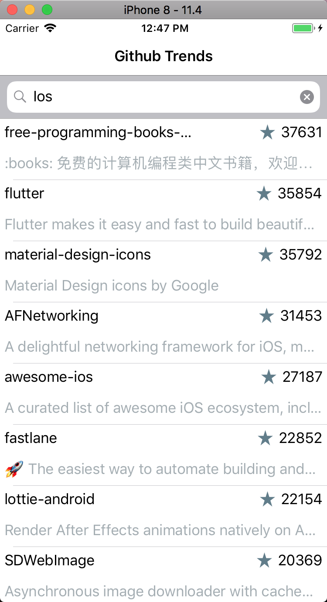
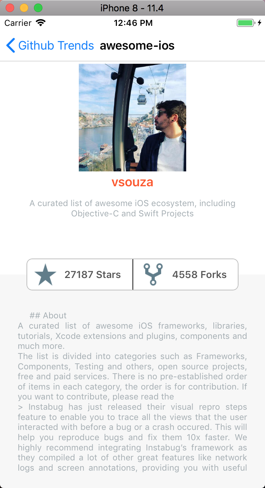

# Github Trends

Searches for github projects which have biggest stars and also shows how many time times they were forked.

### Development languages

```
Swift
```

### Supported platforms

```
iPhone
```

### Supported orientations

* __Landscape__
* __Portrait__

### Supported localization

* __English__
* __Spanish__


### Supported patters

* __MVC__ - General UI architecture
* __MVVM__ - Architecture based on binding of properties inside specific ViewModels between Views and Models
* __Low Coupling__ - To support low dependency, low change impact, and increased reuse. Implemented using Protocols

### Used Pods

* [ReactiveCocoa](https://github.com/ReactiveCocoa/ReactiveCocoa) - Used to have __Binding__ approach in scope of MVVM architecture
* [SnapKit](http://snapkit.io/) - Used to setup __auto-layout__ constrains in easy way
* [UIColor_Hex_Swift](https://github.com/yeahdongcn/UIColor-Hex-Swift) - Used to create __UIColors__ from Hex string e.g. "#ff0000"
* [ionicons](https://github.com/sweetmandm/ionicons-iOS) - Used to fetch "Stars" and "Forks" icons
* [BadgeSegmentControl](https://github.com/floriangbh/BadgeSegmentControl) - Custom __SegmentControl__ to have segment with icons/texts at the same time

### Notes

* __UI design__ - Basically, all UI elements could be created using Storyboard or NIBs files, but for best performance reasons and simply as example UI views have been generated from code using __SnapKit__ pod, which is pretty simple to use. Also, in details controller, View with elements is separated to have clear picture of responsibilities.

* __Extensions__ - To have less code and clear as possible methods, customization functionality of used controls moved to extension. String, Data, URLRequest common code also moved to extensions.

* __Constants__ - To easily manage static values, all of them moved and structured to separate file with nested structs.

* __Services__ - Used to store and manage __Models__

* __AppDelegate__ - Used as holder of main global __services__

* __Navigation__ - class. Used to encapsulate navigation logic based on type of ViewModels


 
 
 
 
 
